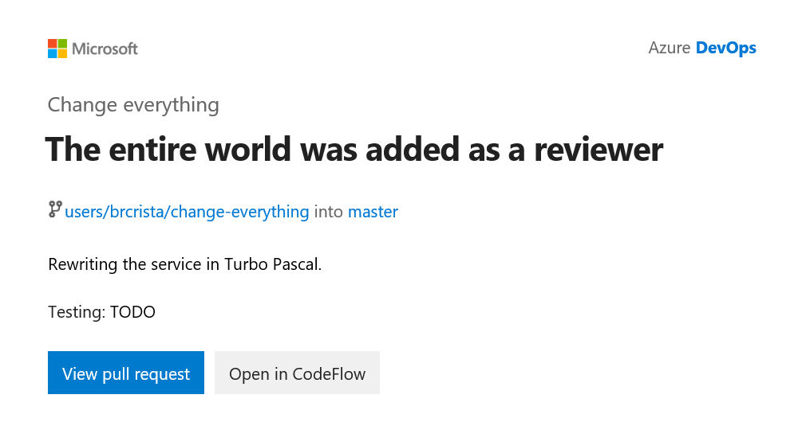

# A Minute of Your Time

[](https://dev.azure.com/brcrista/A%20Minute%20of%20Your%20Time/_build/latest?definitionId=122&branchName=master)



Having a pull request stuck in review for days on end is never fun.
Addressing all the feedback on a big PR can be frustrating for you, and it makes it harder for reviewers to provide helpful feedback on your changes.
Even when a large change is necessary, having an accurate estimate of how long it will take to get through review will help set expectations and reduce the risk of missing deadlines.

## Instructions
### Requirements
* .NET Core 2.2 or later
* Miniconda with Python 3.7 or later

(Older versions may work, but I haven't tested them.)

### First-time setup
Create the conda environment on your system:

```bash
conda env create -f environment.yml
```

After doing this once, activate the environment with:

```bash
conda activate a-minute-of-your-time
```

(**Note:** conda environments don't work in PowerShell.)

### Fetching pull request data from your repo
Build the `FetchPullRequestData` tool:

```bash
cd src
dotnet build FetchPullRequestData
```

Navigate to the `bin` directory and run the tool:

```bash
dotnet FetchPullRequestData.dll --url https://dev.azure.com/my-org --project MyProject --pat ***** --repository RepositoryName --count 1000
```

The output will be in a directory called `./output`.
You can change this by passing the `--outdir` argument.

### Data analysis
Run the Jupyter notebook for data analysis:

```bash
cd src/data-analysis
jupyter lab data-analysis.ipynb
```

## TODO
- [x] Make a tool to get data from the Azure Repos REST API
- [x] Write a script to process this data to be consumed from Python
- [x] Create a Python script that runs exploratory data analysis on the dataset, consumable as a Jupyter notebook
- [ ] Train machine learning models to predict the time to review a new pull request
- [ ] Automate the whole thing end-to-end
